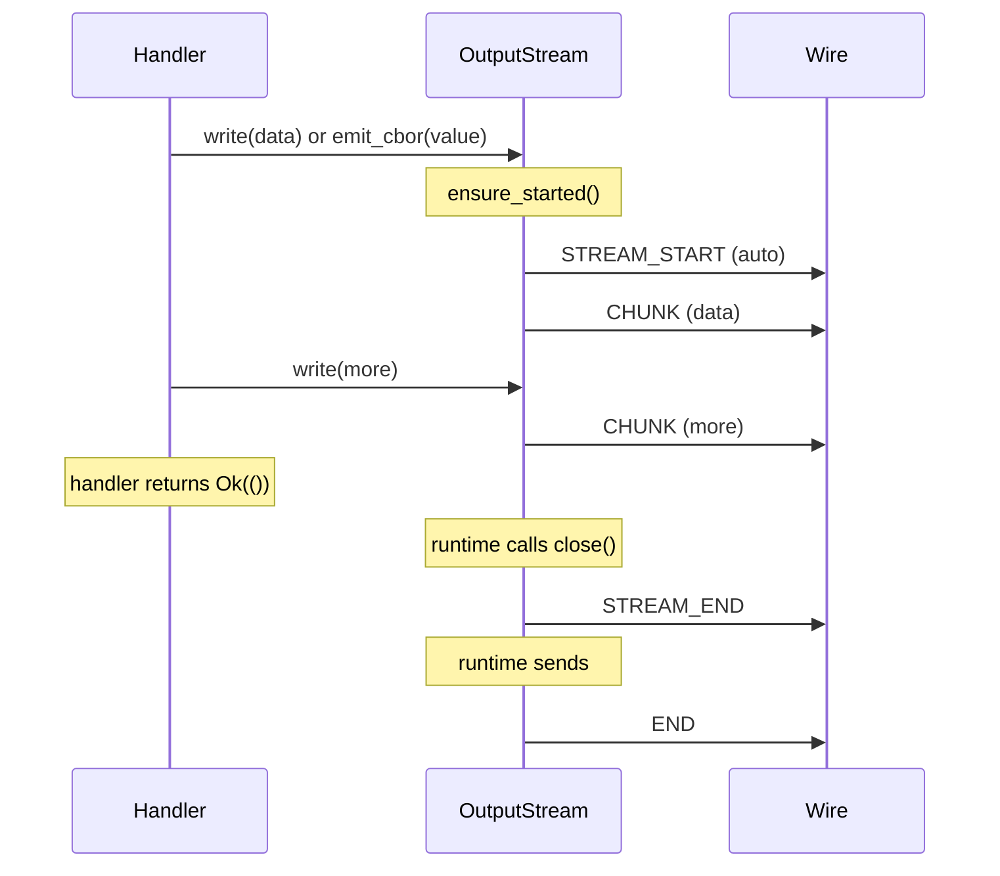

# Input and Output

How handlers receive input data and emit output data via typed streams.


## Writes Are Async and Flow-Controlled

Every data write is flow-controlled (one credit per CHUNK, see
[12.5-FLOW-CONTROL.md](/docs/12.5-flow-control)), which changes the handler
API surface:

- `OutputStream::write`, `emit_list_item`, and `emit_cbor` are **`async fn`**
  — they await when the receiver's window is exhausted. Append `.await` at
  every call site.
- `blocking_write` / `blocking_emit_list_item` serve non-async contexts (FFI
  threads, `spawn_blocking` closures). `StreamSender` (the detached emitter)
  keeps its sync signature and acquires credit blockingly.
- `log()` / `progress()` stay sync and are never flow-controlled — progress
  must flow even when the data window is exhausted (L14).
- `start_unbounded(is_sequence, meta)` opens a stream with no length promise
  (L16); its STREAM_END omits chunk_count. `InputStream::is_unbounded()`
  reports the flag on the consuming side, and the `collect_*` helpers refuse
  unbounded streams with a hard error — consume them with `recv()`.
- `finish(progress, message)` declares the request's terminal status, carried
  in the END frame's terminal metadata (L5). Do NOT emit a trailing 100%%
  progress LOG — the END metadata IS the final progress event.

## InputStream

An `InputStream` represents a single named input stream arriving from the host. Each stream carries a `media_urn` identifying the data type (e.g., `"media:ext=pdf"`, `"media:enc=utf-8"`) and yields decoded CBOR values extracted from CHUNK frames.

Handlers never see raw frames, sequence numbers, checksums, or stream IDs. The runtime's demux layer decodes CHUNK payloads, verifies checksums, and delivers clean CBOR values through the stream.

```rust
pub struct InputStream {
    media_urn: String,
    rx: mpsc::UnboundedReceiver<Result<ciborium::Value, StreamError>>,
}
```

Source: `capdag/src/bifaci/cartridge_runtime.rs:146`.

### Receiving Data

Three consumption patterns:

**Streaming** — process values one at a time:

```rust
let mut stream = /* from InputPackage */;
while let Some(item) = stream.recv().await {
    let value = item?;
    // process each CBOR value
}
```

**Accumulate bytes** — collect everything into a byte buffer:

```rust
let bytes: Vec<u8> = stream.collect_bytes().await?;
```

`collect_bytes()` extracts the inner bytes from each `Value::Bytes` or `Value::Text` chunk and concatenates them. Non-byte CBOR types are CBOR-encoded before appending. Only use this when you know the stream is finite — infinite streams block forever.

**Single value** — expect exactly one chunk:

```rust
let value: ciborium::Value = stream.collect_value().await?;
```

Returns the first value and ignores the rest. Returns `StreamError::Closed` if the stream is empty.

## InputPackage

An `InputPackage` bundles all input streams for a single request. Handlers get it by calling `req.take_input()` (which can only be called once — second call returns an error to prevent double-consumption).

```rust
pub struct InputPackage {
    rx: mpsc::UnboundedReceiver<Result<InputStream, StreamError>>,
    _demux_handle: Option<JoinHandle<()>>,
}
```

The package yields `InputStream` objects as STREAM_START frames arrive from the wire. It returns `None` after the END frame, signaling all arguments have been delivered.

Three ways to consume an `InputPackage`:

**Collect each stream separately** (most common):

```rust
let input = req.take_input()?;
let streams: Vec<(String, Vec<u8>)> = input.collect_streams().await?;
// streams = [("media:ext=pdf", <bytes>), ("media:enc=utf-8", <bytes>)]
```

Each stream's bytes are accumulated independently. Use the stream lookup helpers (below) to find specific arguments by media URN.

**Concatenate all streams**:

```rust
let all_bytes: Vec<u8> = input.collect_all_bytes().await?;
```

Useful when a cap has only one input stream and you just want the bytes.

**Iterate streams one at a time**:

```rust
while let Some(stream_result) = input.recv().await {
    let stream = stream_result?;
    println!("Got stream: {}", stream.media_urn());
    let bytes = stream.collect_bytes().await?;
}
```

Source: `cartridge_runtime.rs:266`.

## Stream Lookup Helpers

After collecting streams with `collect_streams()`, use these free functions to find specific arguments:

| Function | Returns | On miss |
|----------|---------|---------|
| `find_stream(streams, media_urn)` | `Option<&[u8]>` | `None` |
| `find_stream_str(streams, media_urn)` | `Option<String>` | `None` |
| `require_stream(streams, media_urn)` | `Result<&[u8]>` | `StreamError` |
| `require_stream_str(streams, media_urn)` | `Result<String>` | `StreamError` |

Matching uses `MediaUrn::is_equivalent()` — both URNs must have the exact same tag set (order-independent). This is an exact match, not subsumption or pattern matching. Both sides know the argument media URNs from the cap definition, so equivalence is the right test.

```rust
let streams = input.collect_streams().await?;
let pdf_data = require_stream(&streams, "media:ext=pdf")?;
let prompt = find_stream_str(&streams, "media:enc=utf-8");
```

The `media_urn` parameter must be the full media URN from the cap's argument definition.

Source: `cartridge_runtime.rs` (`find_stream`, `require_stream`, line 316).

## Argument Roles: the Main Input

Every cap argument has a role, and the contract that assigns it is the canonical
arg-role model every front-end (the `capdag` CLI, the planner's step-requirement
payloads, UIs) presents:

- **Main input.** An arg is the cap's main input iff it declares a `stdin`
  source whose URN is tagged-URN-**equivalent** to the cap URN's `in=` spec
  (`CapArg::is_main_input`) — never a string comparison, so tag order is
  irrelevant. The main input is the value piped in on stdin, like a Unix
  command's stdin. Its declared slot URN may differ from the stdin URN (e.g. a
  `file-path` slot whose piped content is a `pdf-stream`); the stdin URN, not
  the slot URN, is `in=`. Validation RULE11 guarantees every non-void cap
  declares at least one stdin arg, so the main input always exists.
- **Stream identity.** The runtime demuxes each arg's input stream by
  `CapArg::stream_urn()`: the arg's `stdin` source URN when it declares one,
  otherwise its declared slot media URN.
- **Required options.** Non-main args with `required: true` and no
  `default_value` — an invocation must supply each of them.
- **Options.** The remaining non-main args, carrying their `default_value`.

Consumers of the model: the planner marks the main input on every step argument
(`ArgumentInfo.is_main_input`), and the CLI structures per-cap help and
missing-argument errors around this three-way split (see
[18.1 — CLI Reference](/docs/18.1-cli-reference) §"Cap interface presentation").

## Reference Media and Transport Resolution

Some inputs arrive **by reference**: the value on the wire is not the data,
it is a small pointer the runtime resolves into the data. The contract —
until now enacted only by file paths, stated here as the general rule:

- The arg is declared with a **reference media URN** (the slot URN); its
  `stdin` source carries the **content media URN**; the cap URN's `in=`
  equals the stdin URN. `CapArg::is_main_input` already matches on the
  stdin source, so a reference-fed main input is structurally identical to
  a directly-fed one. RULE3/RULE11 apply unchanged.
- The **runtime's transport-resolution layer** — not the op — recognizes
  the reference URN on an incoming stream, consumes the reference value,
  resolves it, and delivers the resolved content to the op as an ordinary
  `InputStream` labeled with the content URN. The op is transport-blind:
  it cannot tell a resolved reference from directly piped content, and
  must never try.
- On platforms where the cartridge cannot reach the referenced resource
  (sandboxing, device permissions), the **host resolves instead** and
  streams the content over the wire as a normal input stream. Same cap,
  same plan, different resolver — a deployment detail, never a protocol
  one.

Two reference families exist:

### File paths (bounded references)

Reference URN family: `media:file-path` (any URN it accepts). The reference
value is a path string — or, for `is_sequence` args, a newline-separated
list of paths/globs. Resolution reads the file(s) and delivers the bytes as
a bounded stream (scalar) or one item per file (sequence). A missing file,
a failed glob, or a multi-file resolution into a scalar arg is a hard
error. See `FilePathContext` in `cartridge_runtime.rs`.

### Live feeds (unbounded references)

Reference URN family: any URN carrying the **`live` marker tag** —
`media:audio;live;microphone`, `media:image;live;webcam`,
`media:live;synthetic` (the built-in deterministic test feed). The
reference value is a **selector record** (JSON):

| Field | Meaning |
|-------|---------|
| `device` | Provider-defined device selector (id or well-known name). Optional; a provider with exactly one device may default. |
| `params` | Provider-defined capture parameters (sample rate, resolution, …). Optional. |
| `stop` | Stop conditions: `{ "duration_ms": N }` and/or `{ "max_items": N }`. Optional — absent means "until stopped". |
| `on_overrun` | `"drop-oldest"` (default) or `"fail"`. See [12.5-FLOW-CONTROL](/docs/12.5-flow-control) §Overrun. |

Resolution opens the device via a **registered live-feed provider**
(`CartridgeRuntime::register_live_feed_provider`: reference-URN pattern →
provider) and delivers an **unbounded sequence stream** of items labeled
with the arg's stdin content URN. Each item carries per-item metadata
(`pts_us`, `capture_ts_us`, `seq`, and gap markers — see
[12.4-STREAMING](/docs/12.4-streaming) §Live Feeds). An unregistered
reference URN, an unparseable selector, or a device the provider cannot
open is a hard error — never a silent empty stream. Selector parsing is
**strict at every nesting level**: an unknown field — in the selector or
inside `stop` — is rejected (a misspelled stop condition silently ignored
would run an unbounded feed the caller meant to bound). An empty value is
the all-defaults selector; its canonical spelling is `{}` (clients
serialize selectors with defaults omitted and keys sorted, so equal
selections are byte-equal). Family membership is the encapsulated
`is_live_feed` media-URN predicate, present in all five implementations.

The runtime ships one built-in provider: `media:live;synthetic`, a
deterministic clock source (selector params: `items`, `interval_ms`,
`item_bytes`, `ring`, plus overrun injection) used by the shared test
range and available as a fixture feed everywhere. Hardware providers
(microphone, webcam) are registered by the audio/video cartridges on
platforms where the cartridge process may capture; on sandboxed platforms
the host performs the capture and the provider seam is not involved.

**Backpressure and delivery.** A live feed's delivery channel into the op
is **bounded** — the chain is: wire credit stalls the op's output → the op
stops consuming input → the bounded feed channel fills → the provider's
feeder stops draining the capture ring → the ring fills → the capture edge
applies the overrun policy. Loss can occur ONLY at the capture edge, only
under the declared policy, and always counted (§Overrun). This is the live
analog of L10's deadlock-freedom: every stage has a full-state behavior
and none of them is "buffer forever".

**Ending.** A feed ends when a stop condition fires, when the request is
stopped (the runtime closes all live feeds for the request and lets the
pipeline drain — see [15.2-EXECUTION](/docs/15.2-execution) §Runs Stop),
or when the request is aborted. The feed's end is an ordinary input-stream
end: the op observes it exactly as it observes a file stream ending.

## Response Media Labeling: the Effect Contract

The media URN a response STREAM_START carries is **derived by the runtime,
not chosen by the op**. `derive_response_media(cap_urn)` (Rust; the same
function exists in every runtime port) computes it from the cap's declared
effect over its declared main input — the label every engine-fed input
stream carries:

| Effect | Response label |
|--------|----------------|
| `declared` (default) | the declared `out=` |
| `none` | the declared `in=` — the type passes through |
| `patch` | the declared `in=` with the declared delta applied |

This is `CapUrn::apply_to_runtime_input_media` over the declared input —
the same inference the planner used to refine downstream types at plan
time, so a runtime-labeled response satisfies the engine's effect audit
**by construction**. A cap whose label cannot be derived (unparseable URN,
inapplicable effect) fails the request at dispatch; there is no fallback
label.

The engine audits every emission at receipt (`EffectAudit`, backed by the
single predicate `CapUrn::is_conformant_runtime_output`): before a
response STREAM_START is forwarded to the next step, persisted, or
collected, its media URN must satisfy the producing cap's declared effect
contract. The condition is per-effect:

- `effect=none` / `effect=patch` compute an **exact** output type — the
  emission must be tag-equivalent to the inference. A more specific
  emission is still a violation: the effect promises the type is fully
  determined by the input.
- `effect=declared` promises only the declared `out=` — the emission must
  `conform_to` it. More specific is legal; more generic breaks every
  downstream refinement and fails.

A violation is a hard failure attributed `internal`
(`ExecutionError::EffectContractViolation`), naming the cap URN, the
declared effect, the runtime input, and expected vs actual — raised at
the frame boundary, **before** the pipelined forward relabels the stream
to the downstream declared arg URN, so the relabel is a verified
assertion rather than a mask over a lying cap.

## OutputStream

`OutputStream` is the handler's interface for emitting response data, progress, and log messages. It manages STREAM_START/CHUNK/STREAM_END framing automatically — handlers write data, the stream handles the rest.

```rust
pub struct OutputStream {
    sender: Arc<dyn FrameSender>,
    stream_id: String,
    media_urn: String,
    request_id: MessageId,
    routing_id: Option<MessageId>,
    max_chunk: usize,
    stream_started: AtomicBool,
    chunk_index: Mutex<u64>,
    chunk_count: Mutex<u64>,
    closed: AtomicBool,
}
```

Source: `cartridge_runtime.rs:381`.

### Emitting Data

**Raw bytes** — auto-chunked at `max_chunk` boundaries:

```rust
req.output().write(b"result data here")?;
```

Small writes COALESCE: they accumulate in a per-stream buffer and ship as one CHUNK when the batch reaches 4096 bytes or the oldest buffered byte is 20 ms old at the next write (`COALESCE_MAX_BYTES` / `COALESCE_MAX_AGE`). Chunk boundaries on a scalar stream are non-semantic, so this is invisible to receivers — a per-token emitter produces batches instead of one frame per token. A batch that is due (and any write larger than the threshold) splits at `max_chunk` boundaries (default 256 KB); each piece is wrapped as `Value::Bytes` and sent as a CHUNK frame with checksum, one credit per frame. `flush()` (and `blocking_flush`) force the buffered tail out for explicit mid-stream latency barriers; `close()` always flushes it.

**Single CBOR value**:

```rust
req.output().emit_cbor(&ciborium::Value::Text("hello".to_string()))?;
```

Handles type-specific chunking: `Bytes` values coalesce exactly like `write` (pure byte-stream continuation on a scalar stream); `Text` is split at `max_chunk` boundaries (respecting UTF-8 character boundaries). `Array` elements are sent one per chunk. `Map` entries are sent as `[key, value]` pairs. Scalar types are sent as a single chunk. Every non-`Bytes` emission is an ORDERING BARRIER: it flushes the coalescing buffer first, so nothing overtakes buffered bytes. Sequence items (`emit_list_item`) are never coalesced — their chunk runs delimit items.

**List item** (for streaming list output):

```rust
for item in items {
    req.output().emit_list_item(&item)?;
}
```

Each call CBOR-encodes the value and sends the raw bytes as chunk payloads. The receiver concatenates chunk payloads to produce an RFC 8742 CBOR sequence — one self-delimiting CBOR value per `emit_list_item` call. This differs from `emit_cbor`, which re-wraps each piece as a separate CBOR value.

**Progress and logging**:

```rust
req.output().progress(0.5, "Processing page 3 of 6");
req.output().log("info", "Found 12 images");
```

These emit LOG frames that travel alongside data frames. See [13.4-PROGRESS-AND-LOGGING.md](/docs/13.4-progress-and-logging).

**Close**:

```rust
req.output().close().await?;
```

Flushes any coalesced tail bytes, then sends STREAM_END with the total (coalesced) chunk count — flushing before the count is promised is what makes coalescing lossless. `close` is async because the tail flush may wait on credit; `blocking_close()` is the FFI-thread counterpart. Idempotent — calling it twice is safe.

### Implicit Stream Management



Handlers do not need to send STREAM_START, STREAM_END, or END frames manually:

- **STREAM_START**: Sent automatically before the first chunk. The first call to `write()`, `emit_cbor()`, or `emit_list_item()` triggers it via `ensure_started()`.
- **STREAM_END**: Sent by `close()`.
- **END**: Sent by the runtime after the handler returns.
- **On success**: The runtime calls `close()` after `perform()` returns `Ok(())`, which sends STREAM_END. Then it sends END.
- **On error**: The runtime sends an ERR frame instead of END.

If a handler writes nothing and returns success, the runtime still sends STREAM_START → STREAM_END → END (an empty stream is valid).

## CBOR Encoding Conventions

Arguments and results flow as CBOR values in CHUNK payloads. The encoding conventions:

- **Text arguments** (prompts, file paths, configuration strings): sent as `Value::Bytes` containing UTF-8 encoded text — not JSON-quoted. A prompt string `"hello world"` becomes the raw bytes `hello world`, not `"hello world"`.
- **Binary data** (images, PDFs, model weights): sent as `Value::Bytes` containing raw binary data.
- **JSON structures** (model specs, configuration objects): sent as `Value::Bytes` containing the JSON string in UTF-8.
- **Numeric arguments**: sent as `Value::Bytes` containing the string representation in UTF-8.

This matches the `json_value_to_bytes` convention used in the planner module (see [15.4-PLANNER.md](/docs/15.4-planner)): strings become raw UTF-8 bytes (no JSON quoting), everything else becomes JSON-encoded bytes.

## Swift Equivalent

The Swift OutputStream and InputStream in `capdag-objc/Sources/Bifaci/CartridgeRuntime.swift` follow the same semantics with platform-appropriate types:

- `Data` instead of `Vec<u8>`.
- Methods throw instead of returning `Result`.
- `emit(chunk:)` instead of `emit_cbor()`.
- `emitStatus(operation:details:)` instead of `log()`.
- `runWithKeepalive()` uses a background `Task` instead of `tokio::task::spawn_blocking`.

The stream lifecycle is identical: STREAM_START on first write, STREAM_END on close, END on handler completion.
